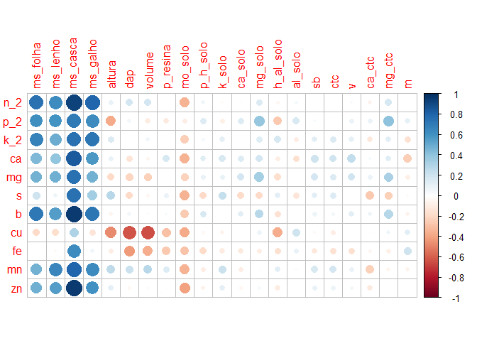
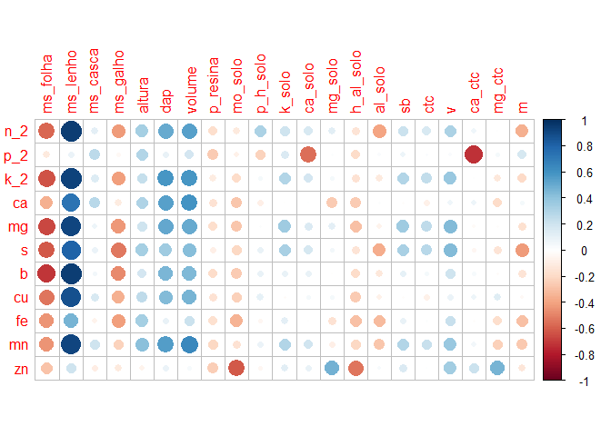

### [PCA exp\_P](https://arpanosso.github.io/natasha-eucalipto/Docs/pca_P.html)

# Análise Eucalipto

## Carregando pacotes exigidos

``` r
library(readxl)
library(tidyverse)
library(janitor)
library(skimr)
```

## Entrada de Dados

``` r
# Nutrientes
nutrientes_planta <- read_excel("data/Acumulo de nutrientes - Compartimentos.xlsx") |> 
  clean_names()
head(nutrientes_planta)
```

    ## # A tibble: 6 x 17
    ##   compartimento bloco parcela     n     p     k    n_2   p_2    k_2     ca    mg
    ##   <chr>         <chr>   <dbl> <dbl> <dbl> <dbl>  <dbl> <dbl>  <dbl>  <dbl> <dbl>
    ## 1 FOLHA         C           1     1     1     1 28032. 2206. 13905. 10051. 5165.
    ## 2 FOLHA         C           1     1     0     1 38938. 2550. 17699. 13663. 4862.
    ## 3 FOLHA         C           2     1     1     1 24969. 2073. 13090.  7580. 4013.
    ## 4 FOLHA         C           2     0     1     1 20342. 1406.  9544.  7319. 3566.
    ## 5 FOLHA         C           3     1     1     1 50073. 3256. 18691. 12046. 5589.
    ## 6 FOLHA         C           3     0     1     1 35626. 2440. 17547. 11726. 5322.
    ## # ... with 6 more variables: s <dbl>, b <dbl>, cu <dbl>, fe <dbl>, mn <dbl>,
    ## #   zn <dbl>

``` r
# Matéria Seca
materia_seca <- read_excel("data/Materia seca - volume - altura - DAP.xlsx") |> 
  clean_names()
head(materia_seca)
```

    ## # A tibble: 6 x 12
    ##   bloco parcela     n     p     k ms_folha ms_lenho ms_casca ms_galho altura
    ##   <chr>   <dbl> <dbl> <dbl> <dbl>    <dbl>    <dbl>    <dbl>    <dbl>  <dbl>
    ## 1 C           1     1     1     1    1589.   12183.     730.    1318.   6.95
    ## 2 C           1     1     0     1    1945.   12020.    1319.    1915.   7.7 
    ## 3 C           2     1     1     1    1274.    8316.     770.    1391.   6   
    ## 4 C           2     0     1     1    1072.    4969.     824.     827.   5.9 
    ## 5 C           3     1     1     1    2484.   12996.    1253.    1940.   6.61
    ## 6 C           3     0     1     1    1663.    8397.     752.     934.   6.72
    ## # ... with 2 more variables: dap <dbl>, volume <dbl>

``` r
# solo 
nutrientes_solo <- read_excel("data/teores de nutrientes no solo - 0-20.xlsx")|> 
  clean_names()
head(nutrientes_solo)
```

    ## # A tibble: 6 x 19
    ##   bloco parcela     n     p     k p_resina mo_solo p_h_solo k_solo ca_solo
    ##   <chr>   <dbl> <dbl> <dbl> <dbl>    <dbl>   <dbl>    <dbl>  <dbl>   <dbl>
    ## 1 C           1     1     1     1       38      14      4.3    2.5       5
    ## 2 C           1     1     0     1        3      14      4      2.8       3
    ## 3 C           2     1     1     1        6      14      3.6    0.7       1
    ## 4 C           2     0     1     1        2      12      4      3.1       2
    ## 5 C           3     1     1     1       11      14      4.1    0.6       2
    ## 6 C           3     0     1     1        1      13      4      0.6       4
    ## # ... with 9 more variables: mg_solo <dbl>, h_al_solo <dbl>, al_solo <dbl>,
    ## #   sb <dbl>, ctc <dbl>, v <dbl>, ca_ctc <dbl>, mg_ctc <dbl>, m <dbl>

### Operação de reunião do banco de dados

``` r
materia_seca_solo <-left_join(x = materia_seca,
          y = nutrientes_solo,
          by=c("parcela","bloco", "n", "p","k"))
```

### Reunião do banco de dados com o arquivo de compartimento

Note que foram adicionadas as doses para os respectivos tratamentos
(parcelas)

``` r
dados <- right_join(materia_seca_solo, nutrientes_planta,
           by=c("parcela","bloco", "n", "p","k")) |> 
  mutate(
    Dose_N = case_when(
    parcela == 2 ~ 0,
    parcela == 3 ~ 70,
    parcela == 4 ~ 105,
    TRUE ~ 140),
    
    Dose_P = case_when(
    parcela == 5 ~ 0,
    parcela == 6 ~ 40,
    parcela == 7 ~ 100,
    TRUE ~ 70),
    
    Dose_K = case_when(
    parcela == 8 ~ 0,
    parcela == 9 ~ 90,
    parcela == 10 ~ 135,
    TRUE ~ 180)

  )

write.table(dados,"data/dados.txt",row.names = FALSE, quote = FALSE, sep = "\t")
```

### Vamos separar os experimentos

``` r
exp_N <- 1:4
exp_P <- c(1,5:7)
exp_K <- c(1,8:10)

expN <- dados |> 
  filter(parcela %in% exp_N)

expP <- dados |> 
  filter(parcela %in% exp_P) 

expK <- dados |> 
  filter(parcela %in% exp_K)
```

## Estatística Descritiva - N

``` r
skim(expN)
```

|                                                  |      |
|:-------------------------------------------------|:-----|
| Name                                             | expN |
| Number of rows                                   | 64   |
| Number of columns                                | 41   |
| \_\_\_\_\_\_\_\_\_\_\_\_\_\_\_\_\_\_\_\_\_\_\_   |      |
| Column type frequency:                           |      |
| character                                        | 2    |
| numeric                                          | 39   |
| \_\_\_\_\_\_\_\_\_\_\_\_\_\_\_\_\_\_\_\_\_\_\_\_ |      |
| Group variables                                  | None |

Data summary

**Variable type: character**

| skim\_variable | n\_missing | complete\_rate | min | max | empty | n\_unique | whitespace |
|:---------------|-----------:|---------------:|----:|----:|------:|----------:|-----------:|
| bloco          |          0 |              1 |   1 |   1 |     0 |         2 |          0 |
| compartimento  |          0 |              1 |   5 |   5 |     0 |         4 |          0 |

**Variable type: numeric**

| skim\_variable | n\_missing | complete\_rate |       mean |        sd |        p0 |       p25 |        p50 |        p75 |       p100 | hist  |
|:---------------|-----------:|---------------:|-----------:|----------:|----------:|----------:|-----------:|-----------:|-----------:|:------|
| parcela        |          0 |              1 |       2.50 |      1.13 |      1.00 |      1.75 |       2.50 |       3.25 |       4.00 | ▇▇▁▇▇ |
| n              |          0 |              1 |       0.62 |      0.49 |      0.00 |      0.00 |       1.00 |       1.00 |       1.00 | ▅▁▁▁▇ |
| p              |          0 |              1 |       0.88 |      0.33 |      0.00 |      1.00 |       1.00 |       1.00 |       1.00 | ▁▁▁▁▇ |
| k              |          0 |              1 |       1.00 |      0.00 |      1.00 |      1.00 |       1.00 |       1.00 |       1.00 | ▁▁▇▁▁ |
| ms\_folha      |          0 |              1 |    1686.07 |    489.33 |    914.02 |   1379.93 |    1622.92 |    1905.29 |    2673.49 | ▅▇▇▁▅ |
| ms\_lenho      |          0 |              1 |    8847.48 |   3747.85 |   1329.84 |   7282.75 |    9262.20 |   11153.97 |   15777.74 | ▂▂▇▅▂ |
| ms\_casca      |          0 |              1 |     942.35 |    255.09 |    500.56 |    765.23 |     858.83 |    1191.36 |    1370.37 | ▁▇▃▁▅ |
| ms\_galho      |          0 |              1 |    1407.27 |    468.43 |    754.52 |   1062.25 |    1354.43 |    1664.69 |    2372.38 | ▅▇▂▂▂ |
| altura         |          0 |              1 |       6.67 |      0.87 |      4.24 |      6.22 |       6.71 |       7.24 |       7.90 | ▁▁▅▇▇ |
| dap            |          0 |              1 |       0.06 |      0.01 |      0.05 |      0.05 |       0.06 |       0.07 |       0.07 | ▇▇▁▂▂ |
| volume         |          0 |              1 |      25.87 |      7.33 |     13.00 |     20.59 |      25.46 |      32.88 |      37.33 | ▅▆▂▅▇ |
| p\_resina      |          0 |              1 |      17.06 |     14.96 |      1.00 |      6.00 |       9.50 |      29.25 |      52.00 | ▇▁▂▂▁ |
| mo\_solo       |          0 |              1 |      14.25 |      1.31 |     12.00 |     13.00 |      14.00 |      15.00 |      17.00 | ▇▇▅▃▂ |
| p\_h\_solo     |          0 |              1 |       4.16 |      0.37 |      3.60 |      4.00 |       4.05 |       4.20 |       5.10 | ▂▇▁▁▂ |
| k\_solo        |          0 |              1 |       5.64 |     15.25 |      0.10 |      0.70 |       2.20 |       2.85 |      64.10 | ▇▁▁▁▁ |
| ca\_solo       |          0 |              1 |       4.69 |      3.50 |      1.00 |      3.00 |       4.00 |       4.25 |      15.00 | ▇▇▁▁▁ |
| mg\_solo       |          0 |              1 |       2.75 |      3.41 |      1.00 |      1.00 |       1.00 |       3.00 |      14.00 | ▇▁▁▁▁ |
| h\_al\_solo    |          0 |              1 |      22.19 |      2.83 |     15.00 |     21.50 |      22.00 |      25.00 |      25.00 | ▁▁▂▇▇ |
| al\_solo       |          0 |              1 |       2.81 |      0.96 |      2.00 |      2.00 |       2.50 |       3.25 |       5.00 | ▇▃▁▃▁ |
| sb             |          0 |              1 |      13.07 |     17.43 |      2.70 |      5.68 |       6.80 |       8.72 |      74.10 | ▇▁▁▁▁ |
| ctc            |          0 |              1 |      35.26 |     17.43 |     24.10 |     28.53 |      30.55 |      31.75 |      99.10 | ▇▁▁▁▁ |
| v              |          0 |              1 |      29.88 |     18.44 |     10.00 |     18.75 |      23.50 |      28.50 |      75.00 | ▇▅▁▁▂ |
| ca\_ctc        |          0 |              1 |      13.19 |      7.11 |      4.00 |      9.50 |      12.50 |      13.25 |      32.00 | ▃▇▁▁▂ |
| mg\_ctc        |          0 |              1 |       7.25 |      7.34 |      3.00 |      3.00 |       4.00 |       7.00 |      30.00 | ▇▁▁▁▁ |
| m              |          0 |              1 |      28.06 |     15.70 |      3.00 |     18.75 |      27.00 |      39.25 |      65.00 | ▅▇▇▃▂ |
| n\_2           |          0 |              1 |   15883.39 |  13005.30 |   2522.82 |   4672.71 |   11655.57 |   24984.34 |   50073.26 | ▇▂▃▁▁ |
| p\_2           |          0 |              1 |    1343.98 |    872.70 |      0.00 |    623.74 |    1201.23 |    2067.29 |    3925.98 | ▇▅▅▂▁ |
| k\_2           |          0 |              1 |   15389.18 |  10967.52 |   4467.49 |   7876.17 |   11908.94 |   18454.19 |   54433.20 | ▇▂▁▁▁ |
| ca             |          0 |              1 |   10229.48 |   5133.29 |   1514.62 |   6376.17 |    9487.28 |   12603.41 |   23445.92 | ▆▇▅▃▂ |
| mg             |          0 |              1 |    3222.16 |   1711.61 |    494.17 |   1745.98 |    2935.48 |    4228.44 |    7017.90 | ▇▇▇▃▃ |
| s              |          0 |              1 |    1355.04 |   1082.66 |    181.54 |    430.34 |     879.79 |    2038.39 |    4575.23 | ▇▂▂▂▁ |
| b              |          0 |              1 |   40152.33 |  27738.70 |   8074.92 |  16224.85 |   28950.21 |   63175.42 |  127242.65 | ▇▃▃▂▁ |
| cu             |          0 |              1 |   13970.10 |  13013.39 |   2659.68 |   5651.08 |   10474.98 |   17757.14 |   63110.95 | ▇▃▁▁▁ |
| fe             |          0 |              1 |  381420.06 | 782301.91 |   9010.06 |  38885.33 |  108872.40 |  321662.84 | 5320684.37 | ▇▁▁▁▁ |
| mn             |          0 |              1 | 1205414.41 | 523411.49 | 160910.84 | 848207.27 | 1143533.91 | 1574355.98 | 2575693.00 | ▃▇▇▅▂ |
| zn             |          0 |              1 |   77269.65 | 126123.51 |   4527.12 |  12489.42 |   19594.37 |   38169.06 |  662665.01 | ▇▁▁▁▁ |
| Dose\_N        |          0 |              1 |      78.75 |     52.17 |      0.00 |     52.50 |      87.50 |     113.75 |     140.00 | ▇▁▇▇▇ |
| Dose\_P        |          0 |              1 |      70.00 |      0.00 |     70.00 |     70.00 |      70.00 |      70.00 |      70.00 | ▁▁▇▁▁ |
| Dose\_K        |          0 |              1 |     180.00 |      0.00 |    180.00 |    180.00 |     180.00 |     180.00 |     180.00 | ▁▁▇▁▁ |

## Estatística Descritiva - P

``` r
skim(expP)
```

|                                                  |      |
|:-------------------------------------------------|:-----|
| Name                                             | expP |
| Number of rows                                   | 64   |
| Number of columns                                | 41   |
| \_\_\_\_\_\_\_\_\_\_\_\_\_\_\_\_\_\_\_\_\_\_\_   |      |
| Column type frequency:                           |      |
| character                                        | 2    |
| numeric                                          | 39   |
| \_\_\_\_\_\_\_\_\_\_\_\_\_\_\_\_\_\_\_\_\_\_\_\_ |      |
| Group variables                                  | None |

Data summary

**Variable type: character**

| skim\_variable | n\_missing | complete\_rate | min | max | empty | n\_unique | whitespace |
|:---------------|-----------:|---------------:|----:|----:|------:|----------:|-----------:|
| bloco          |          0 |              1 |   1 |   1 |     0 |         2 |          0 |
| compartimento  |          0 |              1 |   5 |   5 |     0 |         4 |          0 |

**Variable type: numeric**

| skim\_variable | n\_missing | complete\_rate |       mean |        sd |        p0 |       p25 |        p50 |        p75 |       p100 | hist  |
|:---------------|-----------:|---------------:|-----------:|----------:|----------:|----------:|-----------:|-----------:|-----------:|:------|
| parcela        |          0 |              1 |       4.75 |      2.30 |      1.00 |      4.00 |       5.50 |       6.25 |       7.00 | ▃▁▁▃▇ |
| n              |          0 |              1 |       1.00 |      0.00 |      1.00 |      1.00 |       1.00 |       1.00 |       1.00 | ▁▁▇▁▁ |
| p              |          0 |              1 |       0.50 |      0.50 |      0.00 |      0.00 |       0.50 |       1.00 |       1.00 | ▇▁▁▁▇ |
| k              |          0 |              1 |       1.00 |      0.00 |      1.00 |      1.00 |       1.00 |       1.00 |       1.00 | ▁▁▇▁▁ |
| ms\_folha      |          0 |              1 |    2249.92 |    815.64 |   1250.23 |   1621.80 |    2198.03 |    2622.53 |    4652.62 | ▇▅▅▁▁ |
| ms\_lenho      |          0 |              1 |    7204.70 |   4552.74 |    890.71 |   3201.40 |    7058.08 |   10892.62 |   16121.52 | ▇▂▂▇▁ |
| ms\_casca      |          0 |              1 |     995.79 |    230.34 |    504.13 |    785.18 |    1011.62 |    1173.81 |    1360.99 | ▂▇▆▇▇ |
| ms\_galho      |          0 |              1 |    1637.47 |    629.02 |    824.12 |   1239.13 |    1591.95 |    1891.93 |    3659.95 | ▆▇▁▁▁ |
| altura         |          0 |              1 |       6.84 |      0.61 |      5.47 |      6.46 |       6.95 |       7.24 |       7.70 | ▂▅▅▇▆ |
| dap            |          0 |              1 |       0.06 |      0.00 |      0.05 |      0.06 |       0.06 |       0.07 |       0.07 | ▃▆▇▅▃ |
| volume         |          0 |              1 |      28.00 |      3.93 |     22.78 |     25.38 |      27.27 |      30.82 |      34.39 | ▇▇▆▂▇ |
| p\_resina      |          0 |              1 |      17.12 |     25.66 |      1.00 |      3.00 |       5.50 |      16.00 |     100.00 | ▇▁▁▁▁ |
| mo\_solo       |          0 |              1 |      14.25 |      1.26 |     12.00 |     13.75 |      14.00 |      15.00 |      17.00 | ▅▇▂▂▁ |
| p\_h\_solo     |          0 |              1 |       4.04 |      0.22 |      3.80 |      3.90 |       3.95 |       4.10 |       4.50 | ▇▂▃▁▂ |
| k\_solo        |          0 |              1 |       5.19 |     15.37 |      0.10 |      0.38 |       0.90 |       2.58 |      64.10 | ▇▁▁▁▁ |
| ca\_solo       |          0 |              1 |       3.88 |      2.39 |      1.00 |      2.00 |       3.00 |       5.00 |      10.00 | ▇▇▂▂▁ |
| mg\_solo       |          0 |              1 |       1.69 |      0.85 |      1.00 |      1.00 |       1.50 |       2.00 |       4.00 | ▇▆▁▁▁ |
| h\_al\_solo    |          0 |              1 |      25.12 |      4.11 |     20.00 |     22.00 |      25.00 |      28.00 |      34.00 | ▇▅▂▂▁ |
| al\_solo       |          0 |              1 |       3.44 |      1.13 |      2.00 |      2.00 |       4.00 |       4.00 |       6.00 | ▅▁▇▁▁ |
| sb             |          0 |              1 |      10.75 |     16.72 |      3.10 |      4.92 |       6.25 |       7.22 |      74.10 | ▇▁▁▁▁ |
| ctc            |          0 |              1 |      35.88 |     16.76 |     25.70 |     29.25 |      32.05 |      34.10 |      99.10 | ▇▁▁▁▁ |
| v              |          0 |              1 |      24.12 |     15.77 |      9.00 |     15.00 |      19.50 |      25.00 |      75.00 | ▇▂▂▁▁ |
| ca\_ctc        |          0 |              1 |      11.38 |      6.91 |      3.00 |      7.00 |      10.00 |      13.75 |      31.00 | ▇▇▂▁▁ |
| mg\_ctc        |          0 |              1 |       4.81 |      2.42 |      3.00 |      3.00 |       3.50 |       6.00 |      12.00 | ▇▃▂▁▁ |
| m              |          0 |              1 |      35.44 |     16.66 |      3.00 |     22.00 |      39.00 |      45.00 |      65.00 | ▅▃▇▆▃ |
| n\_2           |          0 |              1 |   18281.41 |  17007.18 |   2299.41 |   5112.40 |   10535.14 |   26079.38 |   86957.47 | ▇▃▂▁▁ |
| p\_2           |          0 |              1 |    1616.98 |   1134.56 |      0.00 |    685.35 |    1457.43 |    2427.10 |    4337.74 | ▇▅▇▂▂ |
| k\_2           |          0 |              1 |   15412.46 |   9842.65 |   1959.57 |   9102.43 |   12705.96 |   20619.08 |   50782.79 | ▇▆▂▁▁ |
| ca             |          0 |              1 |   12231.39 |   7487.79 |    459.88 |   6345.50 |   11266.08 |   17165.18 |   34545.70 | ▇▇▅▃▁ |
| mg             |          0 |              1 |    3276.24 |   2126.15 |    232.64 |   1611.44 |    2751.47 |    4583.05 |   10235.76 | ▇▇▅▂▁ |
| s              |          0 |              1 |    1507.09 |   1234.19 |    222.95 |    499.09 |     909.64 |    2314.17 |    5282.44 | ▇▂▂▂▁ |
| b              |          0 |              1 |   43140.85 |  31712.80 |   4534.98 |  19191.27 |   28814.92 |   65560.29 |  149437.57 | ▇▂▂▁▁ |
| cu             |          0 |              1 |   14877.06 |  13150.07 |   1781.43 |   5908.43 |   10542.33 |   18216.39 |   60099.89 | ▇▂▁▁▁ |
| fe             |          0 |              1 |  416231.92 | 789035.35 |  14609.68 |  42085.90 |   99488.74 |  413540.17 | 5320684.37 | ▇▁▁▁▁ |
| mn             |          0 |              1 | 1428486.12 | 772149.97 | 114902.17 | 934722.04 | 1337954.52 | 1861245.58 | 3973337.44 | ▅▇▃▂▁ |
| zn             |          0 |              1 |   63399.85 | 101695.09 |   5545.41 |  13197.47 |   20745.79 |   53974.46 |  532010.14 | ▇▁▁▁▁ |
| Dose\_N        |          0 |              1 |     140.00 |      0.00 |    140.00 |    140.00 |     140.00 |     140.00 |     140.00 | ▁▁▇▁▁ |
| Dose\_P        |          0 |              1 |      52.50 |     37.29 |      0.00 |     30.00 |      55.00 |      77.50 |     100.00 | ▇▇▁▇▇ |
| Dose\_K        |          0 |              1 |     180.00 |      0.00 |    180.00 |    180.00 |     180.00 |     180.00 |     180.00 | ▁▁▇▁▁ |

## Estatística Descritiva - K

``` r
skim(expK)
```

|                                                  |      |
|:-------------------------------------------------|:-----|
| Name                                             | expK |
| Number of rows                                   | 64   |
| Number of columns                                | 41   |
| \_\_\_\_\_\_\_\_\_\_\_\_\_\_\_\_\_\_\_\_\_\_\_   |      |
| Column type frequency:                           |      |
| character                                        | 2    |
| numeric                                          | 39   |
| \_\_\_\_\_\_\_\_\_\_\_\_\_\_\_\_\_\_\_\_\_\_\_\_ |      |
| Group variables                                  | None |

Data summary

**Variable type: character**

| skim\_variable | n\_missing | complete\_rate | min | max | empty | n\_unique | whitespace |
|:---------------|-----------:|---------------:|----:|----:|------:|----------:|-----------:|
| bloco          |          0 |              1 |   1 |   1 |     0 |         2 |          0 |
| compartimento  |          0 |              1 |   5 |   5 |     0 |         4 |          0 |

**Variable type: numeric**

| skim\_variable | n\_missing | complete\_rate |       mean |        sd |        p0 |       p25 |        p50 |        p75 |       p100 | hist  |
|:---------------|-----------:|---------------:|-----------:|----------:|----------:|----------:|-----------:|-----------:|-----------:|:------|
| parcela        |          0 |              1 |       7.00 |      3.56 |      1.00 |      6.25 |       8.50 |       9.25 |      10.00 | ▃▁▁▃▇ |
| n              |          0 |              1 |       0.94 |      0.24 |      0.00 |      1.00 |       1.00 |       1.00 |       1.00 | ▁▁▁▁▇ |
| p              |          0 |              1 |       0.81 |      0.39 |      0.00 |      1.00 |       1.00 |       1.00 |       1.00 | ▂▁▁▁▇ |
| k              |          0 |              1 |       0.75 |      0.44 |      0.00 |      0.75 |       1.00 |       1.00 |       1.00 | ▂▁▁▁▇ |
| ms\_folha      |          0 |              1 |    1956.32 |    700.82 |   1250.23 |   1360.05 |    1800.85 |    2163.75 |    3752.47 | ▇▃▁▂▁ |
| ms\_lenho      |          0 |              1 |    6451.52 |   3585.15 |   1491.03 |   2922.01 |    6846.73 |    8963.45 |   12182.59 | ▇▁▅▃▃ |
| ms\_casca      |          0 |              1 |     856.13 |    246.15 |    612.08 |    722.37 |     782.64 |     888.43 |    1560.93 | ▇▃▁▁▁ |
| ms\_galho      |          0 |              1 |    1677.25 |    546.56 |    867.70 |   1299.03 |    1523.75 |    1970.75 |    2816.45 | ▆▇▅▃▃ |
| altura         |          0 |              1 |       6.62 |      0.76 |      5.30 |      6.10 |       6.66 |       7.19 |       7.70 | ▆▆▃▇▇ |
| dap            |          0 |              1 |       0.06 |      0.01 |      0.05 |      0.05 |       0.06 |       0.06 |       0.07 | ▁▇▇▂▂ |
| volume         |          0 |              1 |      23.11 |      6.02 |     16.16 |     18.48 |      21.87 |      25.45 |      35.02 | ▇▇▁▁▃ |
| p\_resina      |          0 |              1 |     117.69 |    268.09 |      1.00 |      3.00 |      10.50 |      41.50 |     844.00 | ▇▁▁▁▁ |
| mo\_solo       |          0 |              1 |      14.69 |      1.84 |     12.00 |     13.00 |      14.00 |      16.00 |      19.00 | ▇▆▆▃▂ |
| p\_h\_solo     |          0 |              1 |       4.04 |      0.19 |      3.70 |      3.98 |       4.00 |       4.23 |       4.30 | ▂▂▇▁▇ |
| k\_solo        |          0 |              1 |       5.71 |     15.29 |      0.10 |      0.20 |       1.55 |       3.50 |      64.10 | ▇▁▁▁▁ |
| ca\_solo       |          0 |              1 |       3.56 |      2.01 |      2.00 |      2.00 |       3.00 |       4.25 |       9.00 | ▇▂▂▁▁ |
| mg\_solo       |          0 |              1 |       1.69 |      0.77 |      1.00 |      1.00 |       1.50 |       2.00 |       3.00 | ▇▁▅▁▃ |
| h\_al\_solo    |          0 |              1 |      25.00 |      4.55 |     18.00 |     22.00 |      25.00 |      25.75 |      34.00 | ▃▇▇▂▅ |
| al\_solo       |          0 |              1 |       3.31 |      1.17 |      2.00 |      2.00 |       3.00 |       4.00 |       6.00 | ▇▆▇▂▂ |
| sb             |          0 |              1 |      10.96 |     16.58 |      3.20 |      4.97 |       7.00 |       8.53 |      74.10 | ▇▁▁▁▁ |
| ctc            |          0 |              1 |      35.96 |     17.41 |     23.10 |     28.75 |      30.05 |      34.12 |      99.10 | ▇▂▁▁▁ |
| v              |          0 |              1 |      24.62 |     14.14 |     11.00 |     19.00 |      23.50 |      26.00 |      75.00 | ▇▇▁▁▁ |
| ca\_ctc        |          0 |              1 |      10.12 |      4.20 |      5.00 |      7.00 |       9.00 |      11.25 |      20.00 | ▇▆▁▃▁ |
| mg\_ctc        |          0 |              1 |       5.00 |      3.00 |      3.00 |      3.00 |       3.50 |       5.50 |      13.00 | ▇▁▁▁▁ |
| m              |          0 |              1 |      31.31 |     14.29 |      3.00 |     23.75 |      28.50 |      36.25 |      59.00 | ▁▇▇▁▃ |
| n\_2           |          0 |              1 |   15935.60 |  14259.54 |   2181.87 |   5009.60 |    9854.01 |   23597.16 |   60677.49 | ▇▃▁▁▁ |
| p\_2           |          0 |              1 |    1565.96 |   1298.87 |      0.00 |    606.26 |    1175.42 |    2180.44 |    7290.59 | ▇▅▂▁▁ |
| k\_2           |          0 |              1 |   13869.00 |   8296.26 |   3951.23 |   7729.02 |   12129.87 |   17558.12 |   42670.92 | ▇▆▂▁▁ |
| ca             |          0 |              1 |   11063.17 |   6993.05 |    865.33 |   6264.73 |   10597.78 |   13820.68 |   35745.35 | ▆▇▃▁▁ |
| mg             |          0 |              1 |    3489.01 |   1959.16 |    494.17 |   2003.23 |    3108.08 |    4905.15 |    8453.72 | ▇▆▅▃▂ |
| s              |          0 |              1 |    1560.79 |   1662.37 |    221.99 |    480.13 |    1023.97 |    2029.44 |   11401.71 | ▇▂▁▁▁ |
| b              |          0 |              1 |   38766.86 |  27779.63 |  10262.04 |  16607.05 |   25554.46 |   60697.78 |  131827.06 | ▇▂▃▁▁ |
| cu             |          0 |              1 |   13726.91 |  11184.42 |   2921.94 |   5879.58 |    9606.95 |   18541.40 |   60099.89 | ▇▂▁▁▁ |
| fe             |          0 |              1 |  378111.73 | 800183.62 |  12467.82 |  43767.24 |  140425.34 |  323908.41 | 5320684.37 | ▇▁▁▁▁ |
| mn             |          0 |              1 | 1168744.35 | 692294.49 | 148345.08 | 733674.81 | 1043808.90 | 1478076.12 | 3525481.38 | ▆▇▃▁▁ |
| zn             |          0 |              1 |   70378.90 | 115871.45 |   6255.30 |  11433.46 |   21000.33 |   50974.65 |  641655.54 | ▇▁▁▁▁ |
| Dose\_N        |          0 |              1 |     140.00 |      0.00 |    140.00 |    140.00 |     140.00 |     140.00 |     140.00 | ▁▁▇▁▁ |
| Dose\_P        |          0 |              1 |      70.00 |      0.00 |     70.00 |     70.00 |      70.00 |      70.00 |      70.00 | ▁▁▇▁▁ |
| Dose\_K        |          0 |              1 |     101.25 |     67.08 |      0.00 |     67.50 |     112.50 |     146.25 |     180.00 | ▇▁▇▇▇ |

### Análise de Correlação entre grupos de variáveis de N.

``` r
da<-expN
cor(da[6:12],da[13:26]) |> 
  corrplot::corrplot()
```

<!-- --> \#\#\#\#
Compartimento FOLHA:

``` r
da<-expN |> 
  filter(compartimento == "FOLHA")
cor(da[28:38],da[6:26]) |> 
  corrplot::corrplot()
```

<!-- --> \#\#\#\#
Compartimento LENHO:

``` r
da<-expN |> 
  filter(compartimento == "LENHO")
cor(da[28:38],da[6:26]) |> 
  corrplot::corrplot()
```

<!-- -->

#### Compartimento GALHO:

``` r
da<-expN |> 
  filter(compartimento == "GALHO")
cor(da[28:38],da[6:26]) |> 
  corrplot::corrplot()
```

<!-- -->

#### Compartimento CASCA:

``` r
da<-expN |> 
  filter(compartimento == "CASCA")
cor(da[28:38],da[6:26]) |> 
  corrplot::corrplot()
```

<!-- -->

### Análise de Correlação entre grupos de variáveis de P.

``` r
da<-expP
cor(da[6:12],da[13:26]) |> 
  corrplot::corrplot()
```

<!-- --> \#\#\#\#
Compartimento FOLHA:

``` r
da<-expP |> 
  filter(compartimento == "FOLHA")
cor(da[28:38],da[6:26]) |> 
  corrplot::corrplot()
```

<!-- --> \#\#\#\#
Compartimento LENHO:

``` r
da<-expP |> 
  filter(compartimento == "LENHO")
cor(da[28:38],da[6:26]) |> 
  corrplot::corrplot()
```

<!-- -->

#### Compartimento GALHO:

``` r
da<-expP |> 
  filter(compartimento == "GALHO")
cor(da[28:38],da[6:26]) |> 
  corrplot::corrplot()
```

<!-- -->

#### Compartimento CASCA:

``` r
da<-expP |> 
  filter(compartimento == "CASCA")
cor(da[28:38],da[6:26]) |> 
  corrplot::corrplot()
```

<!-- -->

### Análise de Correlação entre grupos de variáveis de K.

``` r
da<-expK
cor(da[6:12],da[13:26]) |> 
  corrplot::corrplot()
```

<!-- --> \#\#\#\#
Compartimento FOLHA:

``` r
da<-expK |> 
  filter(compartimento == "FOLHA")
cor(da[28:38],da[6:26]) |> 
  corrplot::corrplot()
```

<!-- --> \#\#\#\#
Compartimento LENHO:

``` r
da<-expK |> 
  filter(compartimento == "LENHO")
cor(da[28:38],da[6:26]) |> 
  corrplot::corrplot()
```

<!-- -->

#### Compartimento GALHO:

``` r
da<-expK |> 
  filter(compartimento == "GALHO")
cor(da[28:38],da[6:26]) |> 
  corrplot::corrplot()
```

<!-- -->

#### Compartimento CASCA:

``` r
da<-expK |> 
  filter(compartimento == "CASCA")
cor(da[28:38],da[6:26]) |> 
  corrplot::corrplot()
```

<!-- -->
